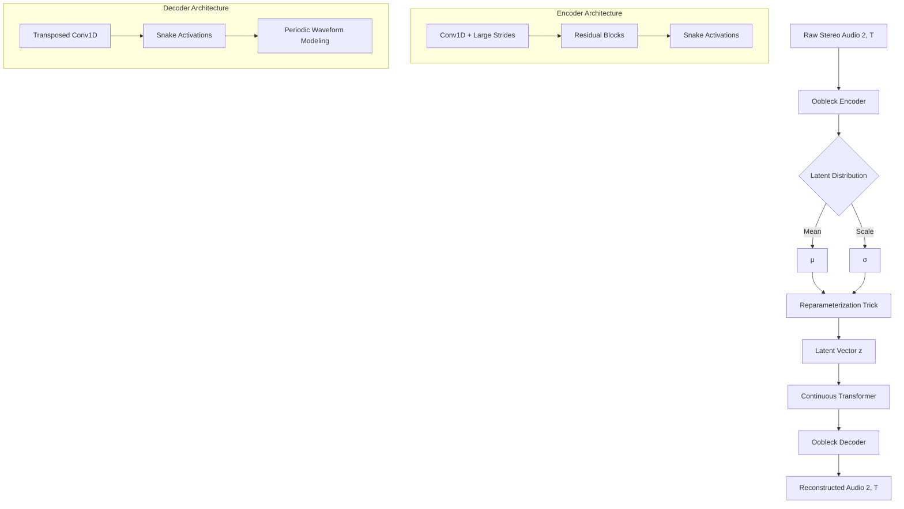
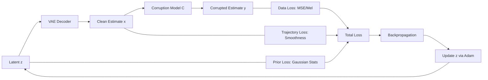

# CS5340 Bayesian Audio Reconstruction: In-Depth Technical Report

This project implements a state-of-the-art **Bayesian Audio Reconstruction** framework. It leverages deep generative priors (EAR-VAE) to solve the inverse problem of recovering high-fidelity audio from signals degraded by non-linear distortions, noise, and time-warping.

---

## 1. System Architecture: EAR-VAE

The backbone of this project is the **EAR-VAE**, a Variational Autoencoder designed specifically for high-sample-rate audio (44.1 kHz).

### 1.1 Model Flow Diagram
The following diagram illustrates the data flow through the EAR-VAE during inference/encoding:

### 1.2 Key Architectural Features
- **Large Downsampling:** The encoder reduces the temporal resolution by a factor of 1024, compressing 44,100 samples per second into ~43 latent vectors per second.
- **Snake Activation:** Unlike ReLU, the `Snake` function ($x + \frac{1}{\alpha}\sin^2(\alpha x)$) is periodic, making it exceptionally good at modeling the oscillating nature of raw waveforms.
- **Continuous Transformer:** Captures long-range dependencies in the latent space, which is critical for musical structure and consistent textures.

---

## 2. The Bayesian Inverse Problem

We treat reconstruction as a **Maximum A Posteriori (MAP)** estimation task. Given a corrupted observation $y = C(x)$, we want to find the clean audio $x$ that maximizes $P(x|y)$.

### 2.1 Optimization Objective
We optimize the latent vector $z$ directly. The total loss $\mathcal{L}$ is:

$$ \min_z \underbrace{\|y - C(G(z))\|_2^2}_{\text{Data Consistency}} + \underbrace{\lambda_{prior} \text{KL}(q(z)\|p(z))}_{\text{Latent Prior}} + \underbrace{\lambda_{traj} \mathcal{R}(G(z))}_{\text{Trajectory Prior}} - \underbrace{\lambda_{jac} \log | \det J_C |}_{\text{Jacobian Correction}} $$

### 2.2 Reconstruction Loop Diagram
The optimization process iteratively updates the latent representation to satisfy both the corruption model and the learned audio prior.

---

## 3. Advanced Prior & Jacobian Techniques

The project goes beyond simple MSE by incorporating physical and mathematical constraints:

### 3.1 Trajectory Priors (Smoothness)
Natural audio does not "jump" randomly. We apply $L_1$ and $L_2$ smoothness constraints:
- **Latent Trajectory:** Forces the compressed representation to evolve smoothly.
- **Waveform Trajectory:** Applied to the raw samples to penalize high-frequency artifacts and "ringing" not present in the original signal.

### 3.2 The Corruption Jacobian
For non-linear corruptions like **Soft Clipping** ($y = \tanh(drive \cdot x)$), the standard MSE loss is biased because $\tanh$ compresses large values more than small ones. To perform true Bayesian inference, we must account for the change of variables:

$$ \log P(x|y) \propto \log P(x) + \log P(y|x) - \log |\det J_C(x)| $$

The Jacobian term $-\log |\det J_C|$ acts as a "stretching" factor that prevents the optimizer from simply pushing all samples into the flat regions of the $\tanh$ curve.

---

## 4. Implemented Corruptions

| Type | Function | Jacobian Mode | Physical Analogue |
| :--- | :--- | :--- | :--- |
| **Soft Clip** | `tanh(x * drive)` | **Exact** (diag) | Analog Preamp Saturation |
| **Tape Wow** | Time-warp (FM) | **Approximate** | Uneven Tape Speed (Mechanical) |
| **Sinusoidal** | $x + \sum \sin(\omega t)$ | Constant (Zero) | Electronic Hum / Interference |
| **Bit Crush** | Quantization | N/A | Early Digital Lo-Fi |
| **FFT Mask** | Bin Zeroing | N/A | Spectral Packet Loss |

---

## 5. Evaluation Framework

To validate the quality of reconstruction, the project uses a multi-faceted evaluation suite:

### 5.1 Objective Metrics (`utils/metrics.py`)
- **Signal Fidelity:** SNR, SDR, SI-SDR (Standard audio engineering metrics).
- **Perceptual Quality:** 
    - **PESQ/STOI:** Standard for speech intelligibility.
    - **DNSMOS:** Deep learning-based Mean Opinion Score for noise suppression.
    - **NISQA:** Non-intrusive speech quality assessment for modern neural codecs.

### 5.2 Visualization
The pipeline generates:
- **Comparison Spectrograms:** Visualizing the frequency restoration (e.g., filling in clipped peaks or masked bins).
- **Metric Comparison Plots:** Radar/Bar charts comparing the corrupted baseline vs. reconstructed outputs.

---

## 6. Project Workflow Summary

The end-to-end `pipeline.py` executes the following logic:

1.  **Clip Slicing:** Divides long audio into 5-second manageable windows.
2.  **Prior Estimation:** Uses a reference clean signal to compute the $\mu$ and $\sigma$ for the latent prior.
3.  **Corruption Simulation:** Degrades the clips using the selected methods.
4.  **Iterative MAP Optimization:** Runs 500-1000 steps of Adam optimization on the latent space $z$.
5.  **Re-Synthesis:** Decodes the final $z$ into a 44.1kHz stereo WAV.
6.  **Reporting:** Compiles all metrics into a `summary.json` for analysis.
